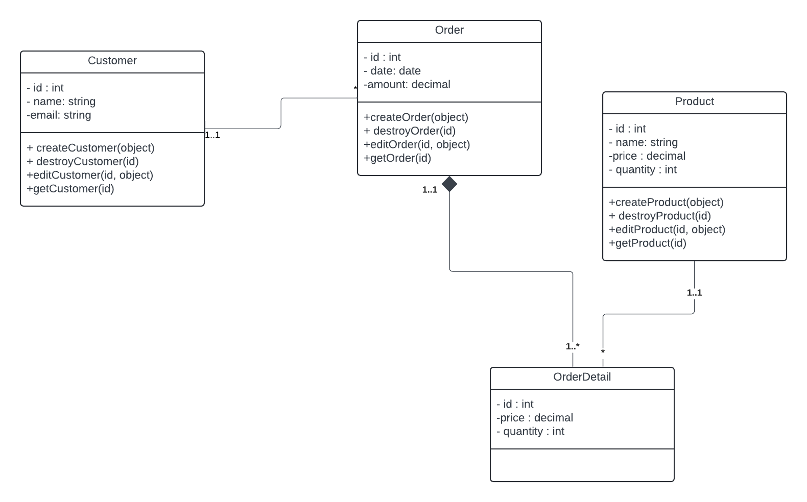

# Gestion des Commandes

Ce projet consiste à implementer les composants métiers d'un système de gestion des commandes en programation orientée objet (POO) et avec express en se basant sur le diagramme de classe pre-établis.

## Prérequis

Avant de commencer, assurez-vous d'avoir installé l'élément suivant:

- [Node.js](https://nodejs.org/) (version 12 ou supérieure)

## Installation

- Clonez ce dépôt :

  ```bash
      git clone https://github.com/HarounaTraore/composant-metier-gestion-commande.git
  ```

- Accédez au répertoire du projet :

  ```bash
      cd composant-metier-gestion-commande
  ```

- Installer les dependences :

  ```bash
        npm install
  ```

## Utilisation

- Lancer le projet :

  ```bash
      npm start
  ```

## Diagramme de classe



## Auteur

[Harouna Adama Traoré](https://github.com/HarounaTraore/)
